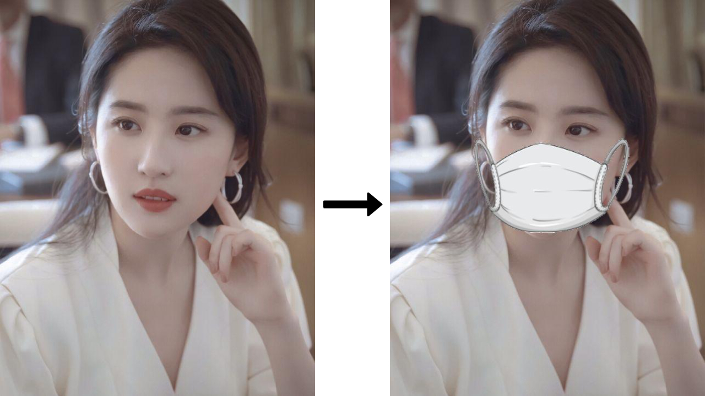
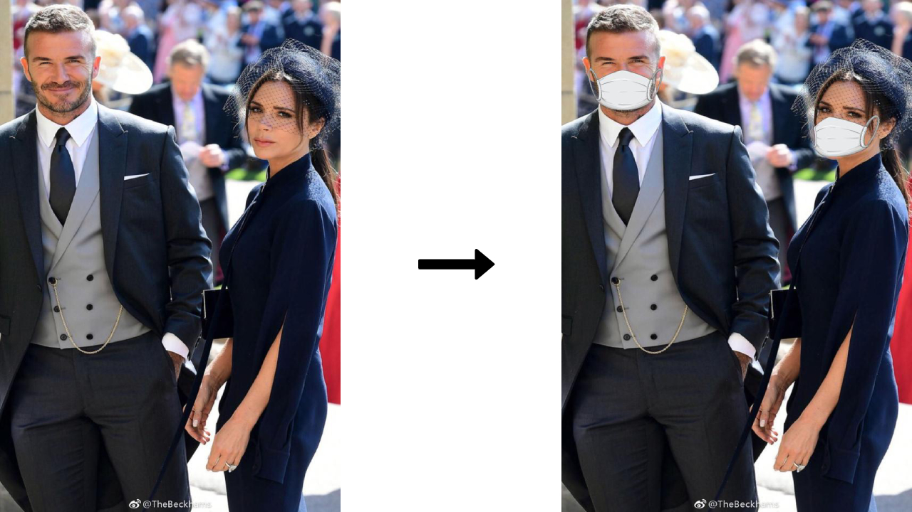

# face-mask
Wear face masks in the given picture.

## Install
Install by pip:
```bash
pip install face-mask
```

Or install locally (`cd` project root directory first):
```bash
python3 setup.py install
```

## Usage
Specify face picture path and then auto save to face with mask picture path 
(whose name with "-with-mask" suffix).
```bash
face-mask /path/to/face/picture
```

If you want to see the new picture with default viewer, please specify `--show` option.
```bash
face-mask /path/to/face/picture --show
```

If you want to wear different mask to face, then specify one of the options below:
- `--black` for black mask
- `--blue` for blue mask
- `--red` for red mask

For instance:
```bash
face-mask /path/to/face/picture --blue
```

In addition, you can specify different detection models by `--model` option:
- `hog` is less accurate but faster on CPUs.
- `cnn` is a more accurate deep-learning model which is GPU/CUDA accelerated (if available).

```bash
face-mask /path/to/face/picture --model cnn
```

## Effects
### One person wears a mask


### Many persons wear masks


### Comic persons wear masks
> Attention: Face recognition for comic face is not accurate enough.


